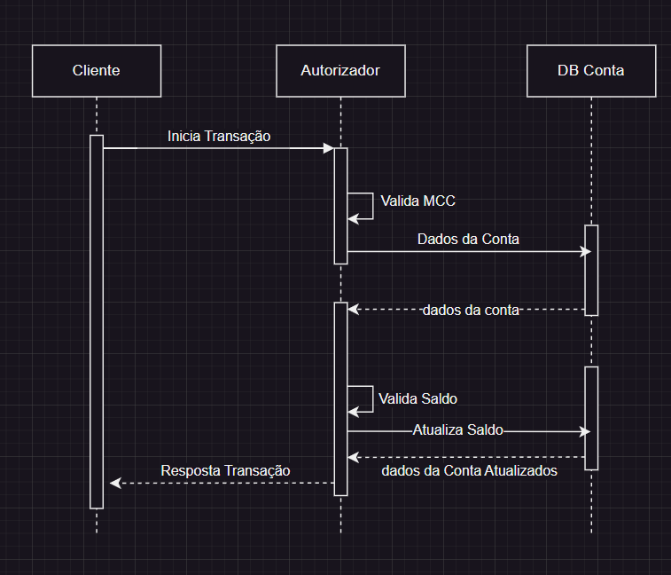

# Desafio - Caju

## Breve Descrição

Aplicação para atender a questões do [Desafio](./Desafio.md).

# L1


Branch

# Respondendo a Pergunta 4 do Desafio (L4).

Para evitar a transação simultânea podemos usar Locks e temos algumas alternativas de implementação.

### Primeira alternativa:


Sendo um banco utilizado com suporte a Pessimist Lock e até em vista de queremos evitar processamentos desnenecessários(
evitando Optimistic Lock), aqui um Pessimist Lock resolveria já que as transações precisam ser até 100ms não seguraria
muito da performance do banco.

### Segunda Alternativa:


Utilizando Redis poderiamos setar uma key, passando um TTL, e assim sempre que fizer uma transação se não existir ele
adiciona ao Redis, e caso exista ele vai desconsiderar a segunda por já estar lockado.

### Terceira Alternativa:


Caso o fluxo possa ser algo mais assíncrono, poderiamos usar um sistema de mensageria que lide com duplicação por
exemplo SQS Fifo, porém com isso seria mais custoso, pois precisariamos de uma aplicação consumidora, nesse caso uma
aplicação ou até poderia ser uma lambda para lidar com as transações.

## Tecnologias Utilizadas

- Kotlin
- Spring
- Arquitetura Hexagonal
- Swagger
- Postgres
- Docker
- Docker Compose

## Estrutura do Projeto

- Application
    - Core: Sem acesso ao mundo externo, livre de frameworks e isolado.
        - Domain: Pode ser acesso por qualquer um.
        - Usecase: Regras de negócio
    - Ports
        - In: Entradas ao core
        - Out: Saidas do core
- Adapters: Implementações das portas de entrada e saida
    - In: Entrada
        - Controller: Controllers Http
    - Out: Saida
        - Adapters: Implementações das portas de saida
        - Repository: Database
- Config: Configurações do Projeto
- Test: Testes da aplicação

## Rodando o Projeto Local

### 1. Pré-requisitos

Certifique-se de ter as seguintes ferramentas instaladas:

- Docker
- Git
- JDK 21 ou superior

### 2. Clonar o Repositório

Clone o repositório do projeto:

```sh
git clone https://github.com/leodelmiro/caju
```

### 3. Executar o Script de Setup

O projeto inclui um script de setup (`setup.sh`) que automatiza o processo de construção e execução do projeto. O script
realiza as seguintes operações:

- Para e remove os contêineres Docker, juntamente com seus volumes.
- Executa a construção do projeto Maven.
- Inicia os contêineres Docker em modo destacável e reconstrói as imagens se necessário.

Para executar o script, siga os passos abaixo:

#### macOS e Linux

1. **Tornar o Script Executável**:

    ```sh
    chmod +x setup.sh
    ```

2. **Executar o Script**:

    ```sh
    ./setup.sh
    ```

#### Windows

1. **Executar o Script**:

   No PowerShell ou Git Bash:

    ```sh
    ./setup.sh
    ```
